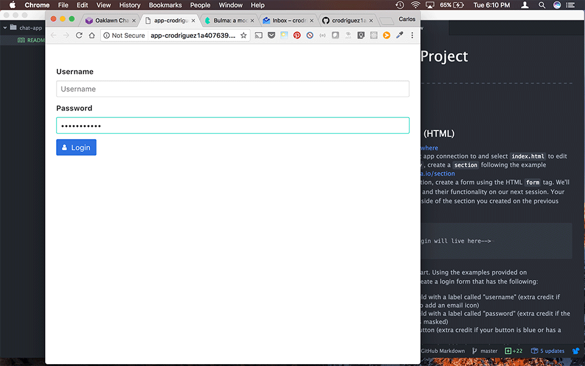

# Chat App Project
---
## Assignments - Building a Login

### You should already have completed...
- Started a CodeAnywhere project, and added **HTML5** container

- Created an `index.html` file using the **SSH Terminal** and the `touch` command

- Written your HTML template, and added two open source **CSS** stylesheets from [Bulma.io](http://Bulma.io/) and [FontAwesome.io](http://fontawesome.io/):

      <html>
        <head>
          <link rel="stylesheet" href="https://cdnjs.cloudflare.com/ajax/libs/bulma/0.4.1/css/bulma.min.css">
          <link rel="stylesheet" href="https://maxcdn.bootstrapcdn.com/font-awesome/4.7.0/css/font-awesome.min.css">
        </head>
        <body>
          Hello world
        </body>
      </html>

### Goals
- Getting familiar with **HTML**

- Learning to leverage community libraries (a.k.a., open source libraries)

  - **Libraries** - Collections of code shared openly by a community of engineers/developers.

- Reading and understanding library documentation

  - **Documentation** - A guide that helps you understand how to use code from a community library

### Instructions

  1. Login to [CodeAnywhere](http://codeanywhere.com)

  2. Click on your chat app connection, then select `index.html` to edit

  3. Inside of the `body`, create a `section` following the example provided on [Bulma.io/section](http://bulma.io/documentation/layout/section/)

  4. Inside of your section, create a form using the HTML `form` tag. We'll discuss form tags and their functionality on our next session. Your form should go inside of the section you created on the previous step.

        <section class="section">
          <form>
            <!-- Your login will live here-->
          </form>
        </section>

  5. Now for the fun part. Using the examples provided on [Bulma.io/form](http://bulma.io/documentation/elements/form/), create a login form that has the following:

    - An input field with a label called "username" (extra credit if you can also add an email icon)

    - An input field with a label called "password" (extra credit if the password is masked)

    - A button with a label called "Login" (extra credit if your button is blue, or has a unique icon from [FontAwesome.io](http://fontawesome.io/))

Your finished product should look something like this:

Good luck!

## Have Questions?

Send me an email me at <a href="mailto:crodriguez1a@gmail.com">crodriguez1a@gmail.com</a>
